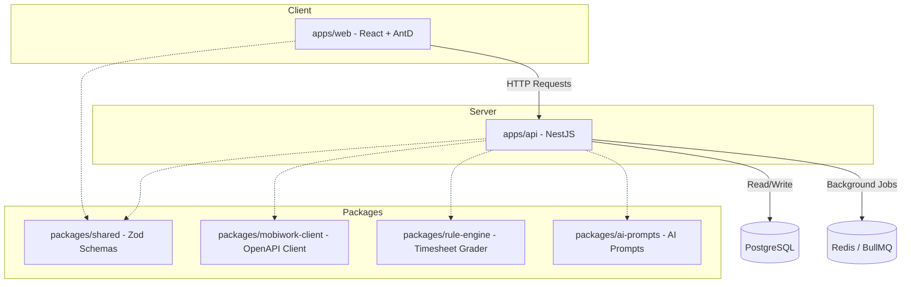

# Kiến trúc Hệ thống DMS AI Admin

Hệ thống được thiết kế theo mô hình **Monorepo** sử dụng **Turborepo** và **pnpm workspaces** để chia sẻ mã nguồn hiệu quả giữa các ứng dụng và thư viện dùng chung.

## Luồng đồng bộ & Chấm điểm (Sync & Scoring Pipeline)

1. **Trigger**: Người dùng gửi yêu cầu đồng bộ (Sync Run) từ Frontend.
2. **Fetch**: `SyncService` sử dụng `mobiwork-client` để gọi API Mobiwork với cơ chế tự động phân trang (pagination) và tự động thử lại khi gặp giới hạn tốc độ (rate limits - HTTP 429).
3. **Persist**: Bản ghi thô được lưu dạng JSON trong bảng `RawRecord` cùng mã hash để chống trùng lặp.
4. **Normalize**: Dữ liệu thô được ánh xạ (mapping) sang các bảng chuẩn hóa (Employee, Customer, TimesheetDay, Visits, Orders, KPI).
5. **Grade**: `rule-engine` tiến hành chấm điểm chuyên cần cho từng ngày công một cách khách quan dựa trên cấu hình ca làm việc và các hệ số điểm trừ.
6. **Evaluate**: Lưu thông tin xếp hạng rủi ro chuyên cần (`GOOD`, `CHECK`, `ABNORMAL`) cùng lý do và đề xuất xử lý vào bảng `TimesheetEvaluation`.
7. **Post-Process (AI)**: Người dùng có thể chạy Trợ lý AI để diễn giải dữ liệu, phát hiện xu hướng bất thường, đề xuất phương án tối ưu và đánh giá chất lượng ảnh check-in thực địa qua AI Vision.
